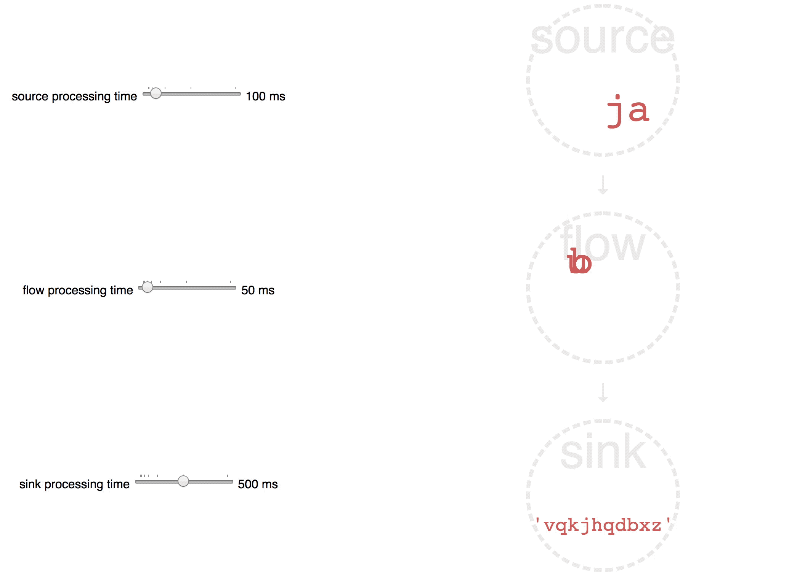

# Akka Stream Visualisation
Javascript visualisation of simple async stream processing using Akka Streams.

The example stream has:
 - a source generating random characters
 - a flow of 1 step that waits for 10 characters and joins them
 - a sink consuming the random words

You can dynamically control processing time of each step to simulate real workload.

If you play with processing times a bit, you should be able to simulate different 
situations, e.g. *fast producer, slow consumer* vs *slow producer, fast consumer*, 
see that *backpressure* is automatically applied, or that messages are 
*buffered in mailboxes* of the processing steps.

## Running

Run the server using `sbt run` and then open `index.html` in your browser.